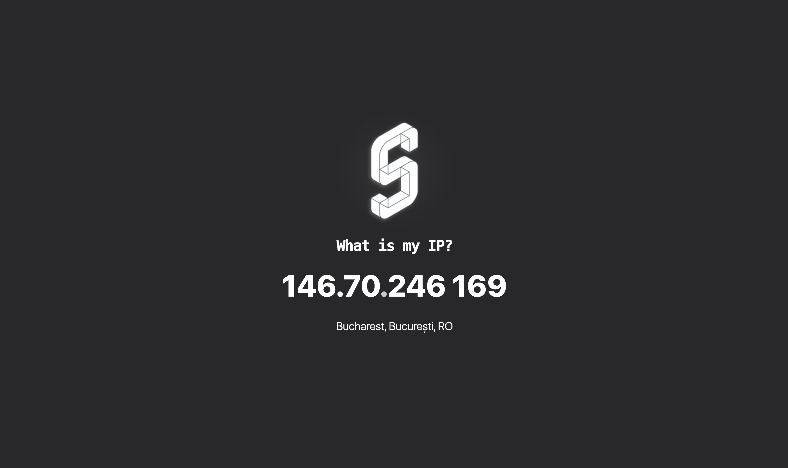
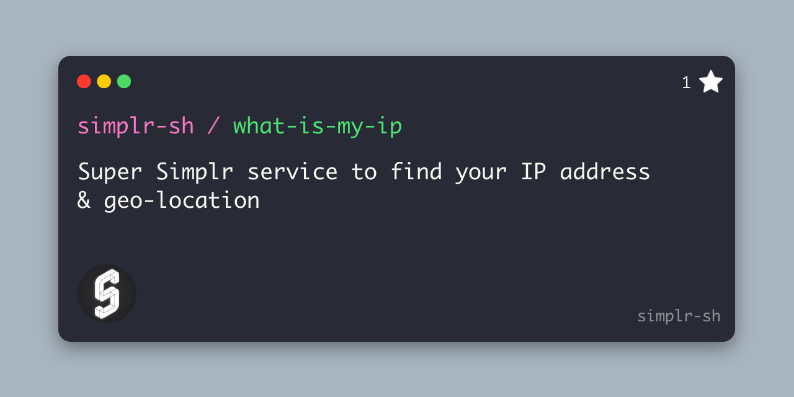

<div align="center">
    
    <h1 align="center">
      <a href="https://what-is-my-ip.simplr.sh">
        What is my IP?
      </a>
    </span>
</div>

### Super Simplr service to find your IP address & geo-location


## Visit <a href="https://what-is-my-ip.simplr.sh">what-is-my-ip.simplr.sh</a>





```
npm install
npm run dev
```

```
npm run deploy
```
